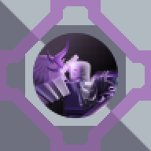
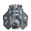

## PHIGHTING! SWORD DEITIES

  

### Disclaimer!
This mod is considered to be unfair due to some of the content being OP,
but then again, play it your own way!
### Information About This Mod
PHIGHTING! SWORD DEITES Is a mindustry mod made by BlueDoves3821.

The mod is obviously based on sword & the 7 sword deites from the roblox game: **PHIGHTING!**

Create swordium.

  

and convert it into either of the 7 sword deites!

  
  
  
  
  
  
  

Currently, there are around 120+ pieces of content, which includes a mobile swordium core for mobile bases.

a swordium melee unit that has a sword.

  
  

a illuminaium n.e.s to invalidate an area to the enemy.

  

or disarm an ememy for almost 17 minutes with the windforceium disarmer.

  

along many more that couldn't fit here!

This mod also includes custom maps too, most of them are just defending the swordium core, but some you'll attack a base.

## PHIGHTING! SWORD DEITIES has a special ability: It has multi-planetary construction!
Because PHIGHTING! Sword Deities has it's own tech tree, whether if it's erekir, serpulo or any modded planet, you can construct the modded buildings on it!
**provided that the sector doesn't have restricted blocks set.**

**researching PHIGHTING! SWORD DEITIES requires the materials to be on serpulo.**

## Closing Thoughts
Because this mod is being worked on by a single user, updates are prone to be slow.
Tweaks may happen from time to time.
One new content may be added every couple of days, but sometimes it'll be weeks.
There's also a stand-alone add-on for this mod called ["Swordium Assisters"](https://github.com/BlueDoves3821/sword-deities-swordium-assisters)
which had to be seperated due to concerns of being too op if included in the mod.
And tbh, i did not expect this mod to gain a bit of traction, so uh, thank you. -BlueDoves3821
